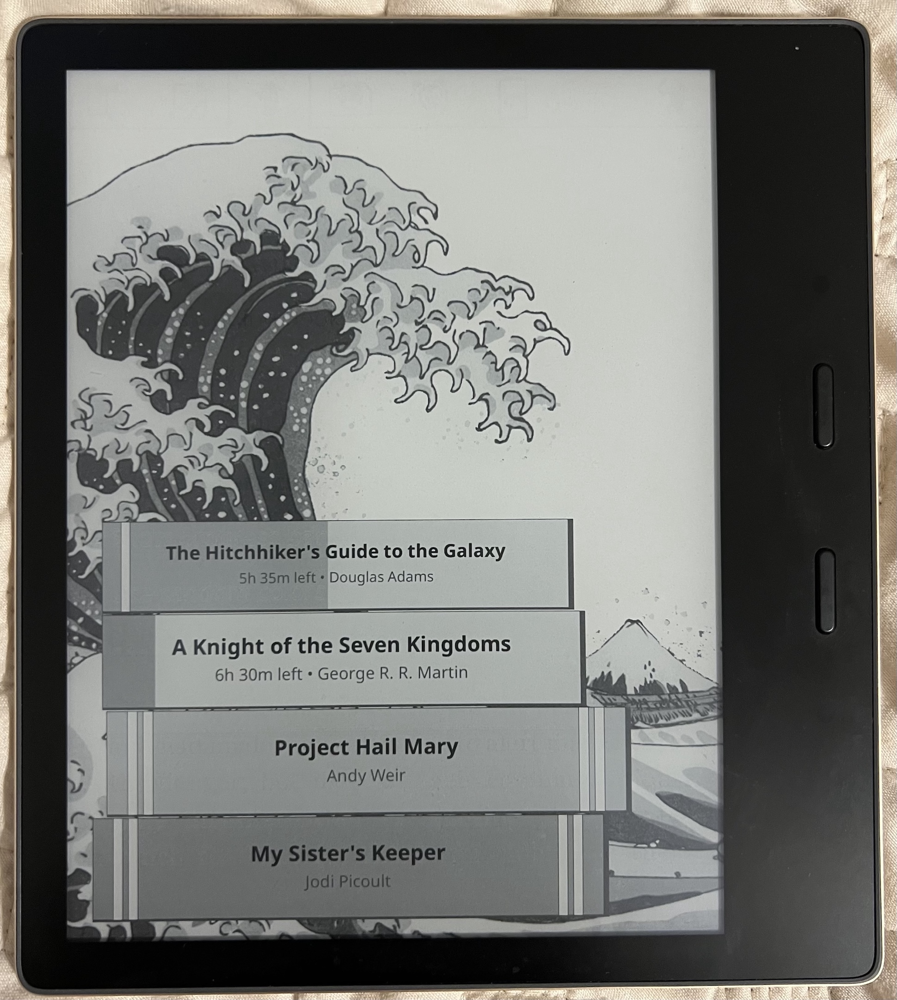
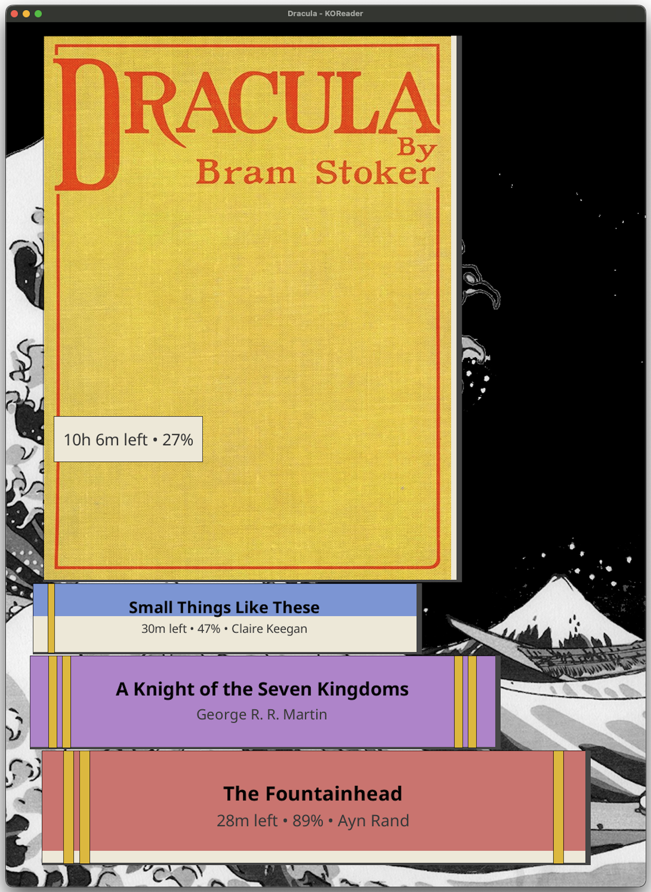

# Koreader patches & plugins

### [2-bookshelf-screensaver.lua](./patches/2-bookshelf-screensaver.lua)

|  |  |
| ------------------------------------------------------------- | ----------------------------------------------- |
| Grayscale (Kindle Oasis)                                      | Color (Emulator)                                |

Features:

1. Shows last few recently read books starting from the top.
2. Vertical book stack where the book spines double as progress bars. These scale with page count.
3. Shows time left and/or percent progress (automatically hidden for finished books).
4. Progress bands at 25%, 50%, 75%, and completion milestones.
5. Decoration on top of the stack.

Config:

| Configurable           | Default    | Note                                                                                      |
| ---------------------- | ---------- | ----------------------------------------------------------------------------------------- |
| Show background        | `enabled`  | Dotted pattern background                                                                 |
| Show standing book     | `enabled`  | Show the currently reading book stand on top of the stack                                 |
| Show stack decoration  | `disabled` | Image on top of the stack (provided cat image)                                            |
| Show time left in book | `enabled`  | Time left in book. Hidden for finished books                                              |
| Show percent completed | `disabled` | Progress percentage in the book. Hidden for finished books                                |
| Show progress bands    | `enabled`  | Bands at progress `25%`, `50%`, `75%`, and `finished`                                     |
| Randomize book colors  | `disabled` | Randomize book colors instead of cycling                                                  |
| Misaligned stack       | `enabled`  | Slightly offset books for a natural look                                                  |
| Number of books        | `5`        | Books to display                                                                          |
| `finished` threshold   | `97`       | Consider book finished if above this % (in order to ignore glossary, appendix, etc pages) |
| Min page threshold     | `0`        | Hide books if below threshold (to filter small PDFs etc)                                  |
| Font size              | `6`        | Font size for text. Truncated if too long                                                 |

Add more or customize book colors in `getBookColor` function.

If you decide to use your own decor (`bookshelf-screensaver-decor.png`) update `STACK_DECOR_OFFSET_X` and `STACK_DECOR_OFFSET_Y` accordingly.

## Installation

1. Copy `2-bookshelf-screensaver.lua` to `koreader/patches`
2. Copy [decoration image](./resources/bookshelf-screensaver-decor.png) to `koreader/resources/bookshelf-screensaver-decor.png`
3. Select "Bookshelf" in `Screen -> Sleep screen -> Wallpaper -> Bookshelf`
4. Configure in `Screen -> Sleep screen -> Wallpaper -> Bookshelf Settings`
